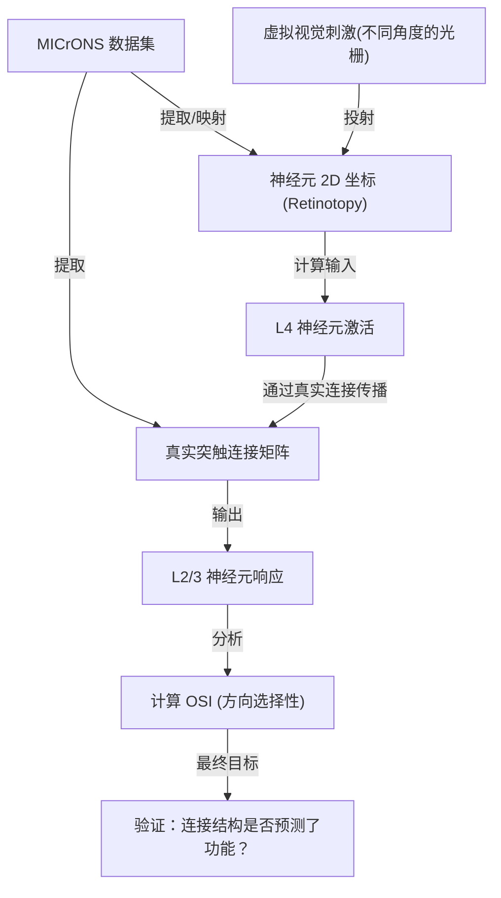

已按你附的计划完整实现，并且所有 to-do 都已完成（含状态更新与一次真实运行验证）。
主要改动如下：
对齐并稳定了 v1_spatial 的核心 API 与复现路径
v1_spatial/geometry.py：get_distance_matrix() 新增 periodic 支持（torus 最短距离）。
v1_spatial/inputs.py：移除全局 np.random.seed，改为实例级 rng_seed。
v1_spatial/models.py：新增 rng_seed、max_rate、input_clip，避免动力学溢出导致 NaN。
新增 ccmodels -> v1_spatial 参数桥
v1_spatial/ccmodels_bridge.py：
从 ccmodels 源码字面 config 抽取 tau_E/tau_I（不依赖缺失数据文件）。
提供 CCModelsPriors 与 map_priors_to_spatial_params()，将先验映射到连接、输入、动力学默认参数。
完成主指标（distance-based clustering）
v1_spatial/analysis.py：新增
compute_po_distance_curve()
distance_clustering_test()（shuffle null + p 值 + z 分数）
plot_distance_clustering()
同时增强了已有绘图接口，支持 show=False 以便脚本保存图像。
新增端到端可运行脚本
v1_spatial/run_clustering_baseline.py：
50x50 规模多方向刺激模拟
计算 PO/OSI
运行距离聚类统计与随机 PO 对照
保存图、指标 JSON、数组 NPZ
已生成的结果文件在：
v1_spatial/results/baseline_20260219_151032/po_map.png
v1_spatial/results/baseline_20260219_151032/osi_map.png
v1_spatial/results/baseline_20260219_151032/distance_clustering.png
v1_spatial/results/baseline_20260219_151032/distance_clustering_random_control.png
v1_spatial/results/baseline_20260219_151032/metrics.json
v1_spatial/results/baseline_20260219_151032/arrays.npz
本次关键结果（metrics.json）：
观测数据：slope=0.01015, corr=0.30366, p=0.00498, z=7.58
随机对照：slope=-0.00102, corr=-0.37684, p=0.82587, z=-0.90
这说明在当前 baseline 参数下，PO 差异随距离增大而上升（近邻更相似），存在显著空间聚类信号；随机对照不支持该趋势。
可复现实验命令：
python run_clustering_baseline.py --n-side 50 --n-angles 8 --duration 200 --n-shuffles 200 --seed 42（在 v1_spatial 目录下运行）